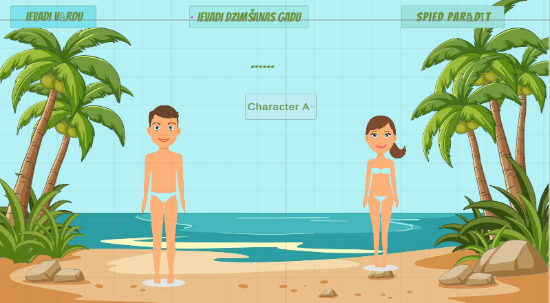

# Pavlovska_UnityUI
Ieskaites Unity 2D projekts

# Pavlovska_UnityUI

## Summer Outfit Designer

Unity 2D UI ieskaites projekts.

## Projekta ideja

Unity 2D projekts, kurā lietotājs var izvēlēties un personalizēt vienu no diviem pludmales tēliem (vīrietis vai sieviete).

Lietotājs var:
- izvēlēties tēlu (Dropdown)
- ievadīt tēla vārdu un dzimšanas gadu
- aprēķināt tēla vecumu
- izvēlēties pludmales apģērbu (peldkostīms, šorti, krekls, cepure u.c.)
- izmantot drag & drop principu aprīkojuma novietošanai
- mainīt tēla izmērus ar Slider palīdzību
- klausīties skaņas efektus
- lasīt tēla aprakstu Scroll View logā

⚠ Projekta sākotnējā ideja paredzēja vēsturisko tēlu personalizēšanu, 
taču assets ierobežojumu dēļ koncepts tika pārveidots uz pludmales tēlu dizaina projektu.

## Projekta ekrānattēli

### Start Scene

### DressUp Scene

## Izmantotie UI elementi

Text, Button, Toggle, Dropdown, Slider, Scroll View, Input Field, Image

## Izstrādes statuss

✔ Izveidots projekts un GitHub repozitorijs  
✔ Izveidotas divas ainas (StartScene, DressUpScene)  
✔ Realizēta pārslēgšanās starp ainām (SceneLoader)  
✔ InputField un vecuma aprēķins  
✔ Dropdown ar diviem tēliem  
✔ Toggle kategorijas  
✔ Drag & Drop aprīkojums  
✔ Slider izmēra maiņa  
✔ Skaņas efekti  
✔ Scroll View apraksts  
⬜ Build Windows/WebGL  

